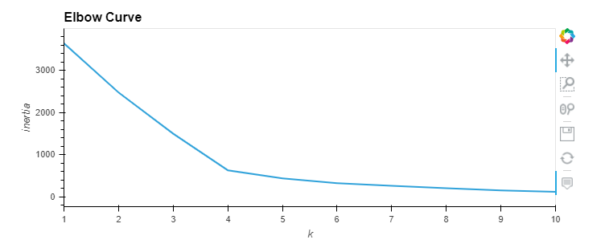
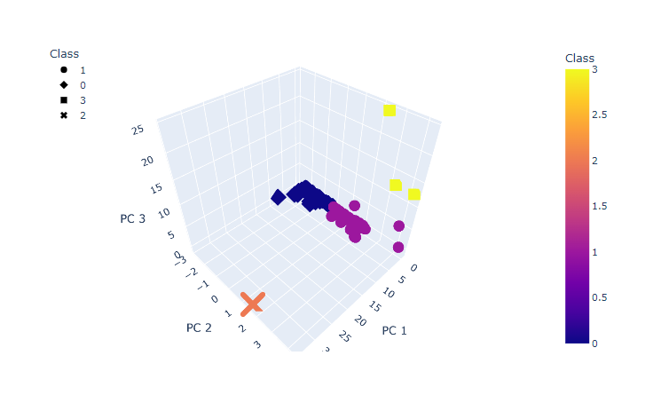
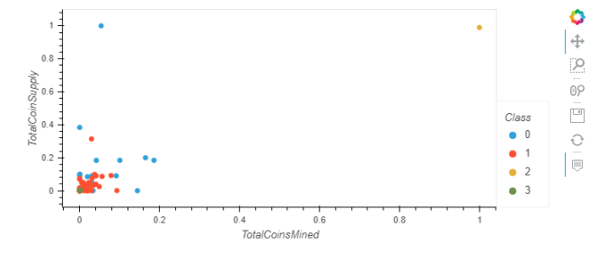

# Cryptocurrencies

## Overview of the analysis 

A prominent investment bank is interested in offering a new cryptocurrency investment portfolio for its customers. 
The company, however, is lost in the vast universe of cryptocurrencies. So, the company would like to create a report 
that includes what cryptocurrencies are on the trading market and how they could be grouped to create a classification 
system for this new investment.

## Purpose 

The purpose of the analysis is to use unsupervised machine learning to process the cryptocurrency data:- 
- To preprocess the data for PCA 
- To reduce data dimensions using PCA
- Clustering Cryptocurrencies Using K-means
- Visualizing Cryptocurrencies with 3D and scatter plot. 

## Resources 

Dataset: crypto_data.csv,
Python 3.7.6 and Anaconda 2020.11

## Results 

Using K-means algorithm an elbow curve was created to find the best value for k. 

Using Plotly Express a 3D scatter plot was created to plot the three clusters with PCA data. 

A hvplot scatter plot was created with x="TotalCoinsMined", y="TotalCoinSupply", and by="Class".

